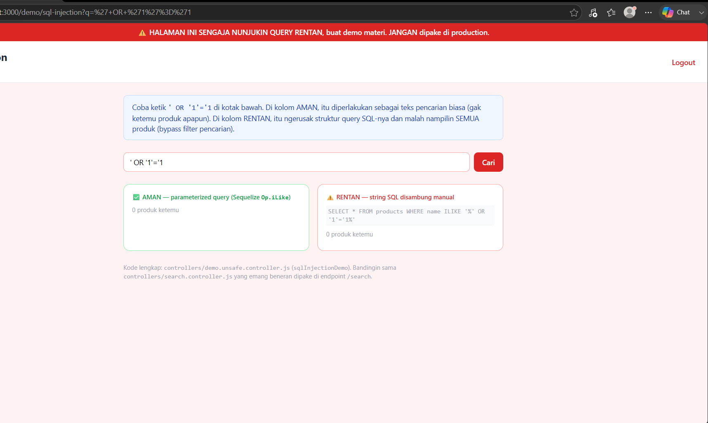
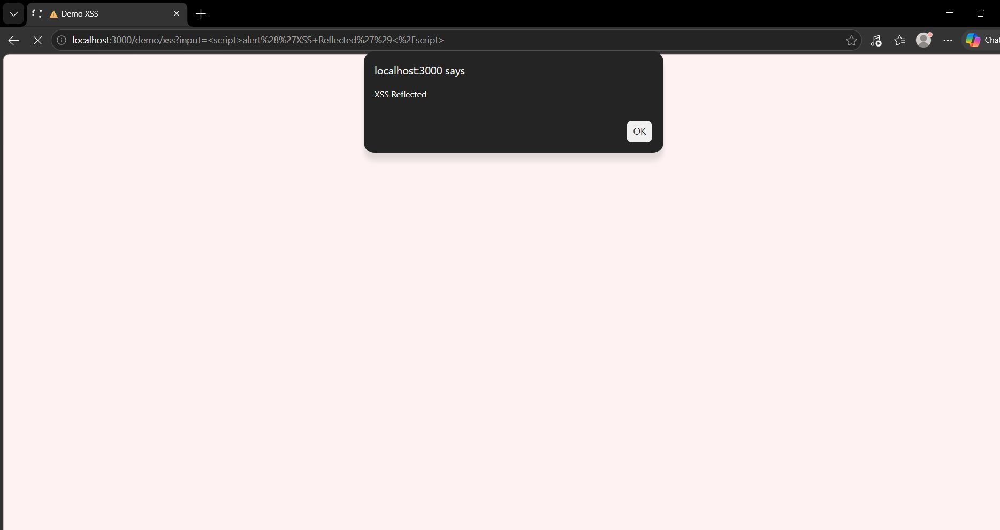
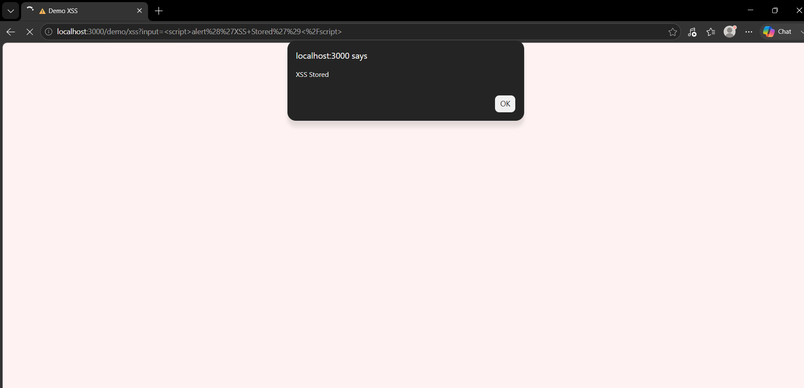
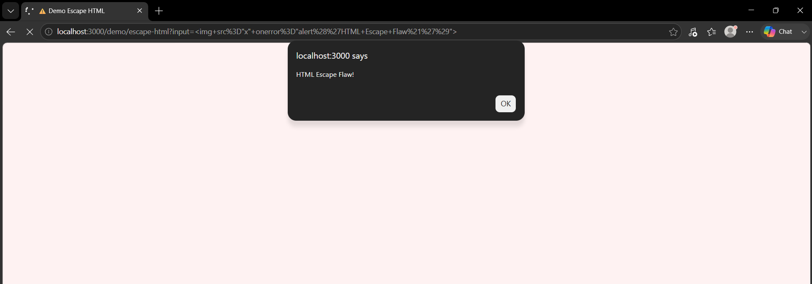
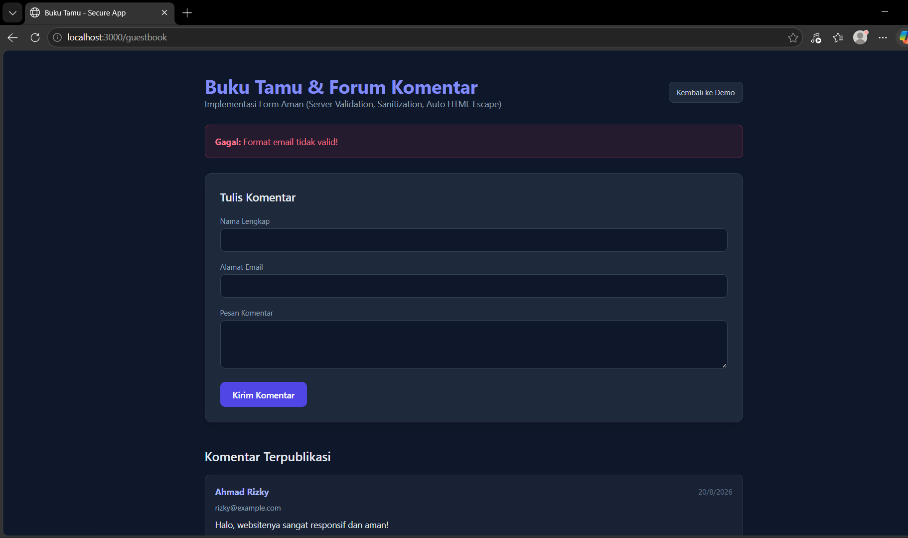

# Laporan Praktikum Keamanan Web (WEEK 12)

**NIM:** [Isi NIM Kamu]  
**Nama:** STARZYYY  
**Kelas:** PAW Kelas B  

---

## Bagian 1 — Eksplorasi Vulnerability Demo

### 1. SQL Injection (`/demo/sql-injection`)
* **Screenshot Payload:**  
  
* **Penjelasan Celah Kode:**  
  Payload `' OR '1'='1` berhasil merusak struktur query SQL pada blok rentan karena string SQL disusun menggunakan penggabungan manual (*string concatenation*) tanpa *parameterized query*. Kondisi `'1'='1'` yang bernilai selalu *true* mengakibatkan bypass filter pencarian.

### 2. XSS Reflected (`/demo/xss`)
* **Screenshot Payload:**  
  
* **Penjelasan Celah Kode:**  
  Payload `<script>alert('XSS Reflected')</script>` langsung dieksekusi oleh browser saat disubmit via URL. Celah ini terjadi karena nilai masukan langsung dirender ke halaman HTML tanpa proses *escaping*.

### 3. XSS Stored (`/demo/xss`)
* **Screenshot Payload:**  
  
* **Penjelasan Celah Kode:**  
  Payload skrip tersimpan secara permanen di database dan tereksekusi otomatis setiap kali halaman di-refresh. Hal ini terjadi karena view menggunakan tag *unescaped HTML* (`<%- %>`) saat menampilkan data dari database.

### 4. HTML Escape Flaw (`/demo/escape-html`)
* **Screenshot Payload:**  
  
* **Penjelasan Celah Kode:**  
  Payload `` berhasil mengeksekusi JavaScript pada blok unescaped (`<%- %>`). Kegagalan melakukan HTML escaping memungkinkan browser merender atribut dan *event handler* HTML mentah.

---

## Bagian 2 — Implementasi Mandiri (Fitur Guestbook / Buku Tamu)

### 1. Server-Side Validation
* **Screenshot Submit Invalid:**  
  
* **Penjelasan:** Validasi dilakukan secara ketat di sisi server (`guestbook.controller.js`). Jika email berformat salah atau kolom kosong disubmit, server menolak request dengan status `400 Bad Request` dan menampilkan pesan kesalahan yang jelas tanpa mengandalkan validasi client-side.

### 2. Sanitasi Input
* **Contoh Potongan Kode Sanitasi:**
  ```javascript
  name = typeof name === 'string' ? name.trim() : '';
  email = typeof email === 'string' ? email.trim().toLowerCase() : '';
  message = typeof message === 'string' ? message.trim() : '';